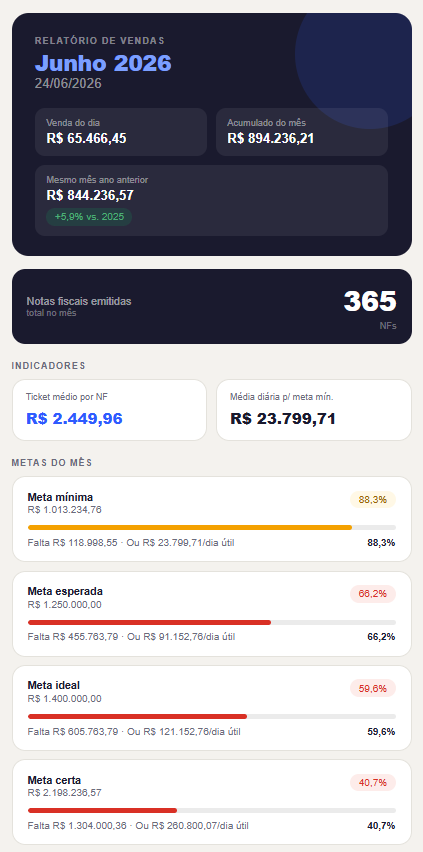

# 📊 Relatório de Vendas

Dashboard diário de vendas desenvolvido em HTML e JavaScript puro.

---

## 📸 Preview do Dashboard

## ✨ Funcionalidades

- Acompanhamento de metas comerciais com **4 níveis de meta**
- Cálculo automático de **percentual atingido** e **valor restante por dia útil**
- Comparação com o mês anterior com **variação percentual**
- Controle de pedidos com **pendências**
- **Painel de input interativo** para lançamento de dados

---

## 🛠️ Tecnologias

---

## 💡 Contexto

Desenvolvido para substituir um processo manual feito no bloco de notas, automatizando o acompanhamento diário de metas de uma equipe comercial.

---

## 🚀 Como usar

1. Clone o repositório ou baixe os arquivos
2. Abra o arquivo `index.html` no navegador
3. Preencha os dados no painel de input e acompanhe as métricas em tempo real
